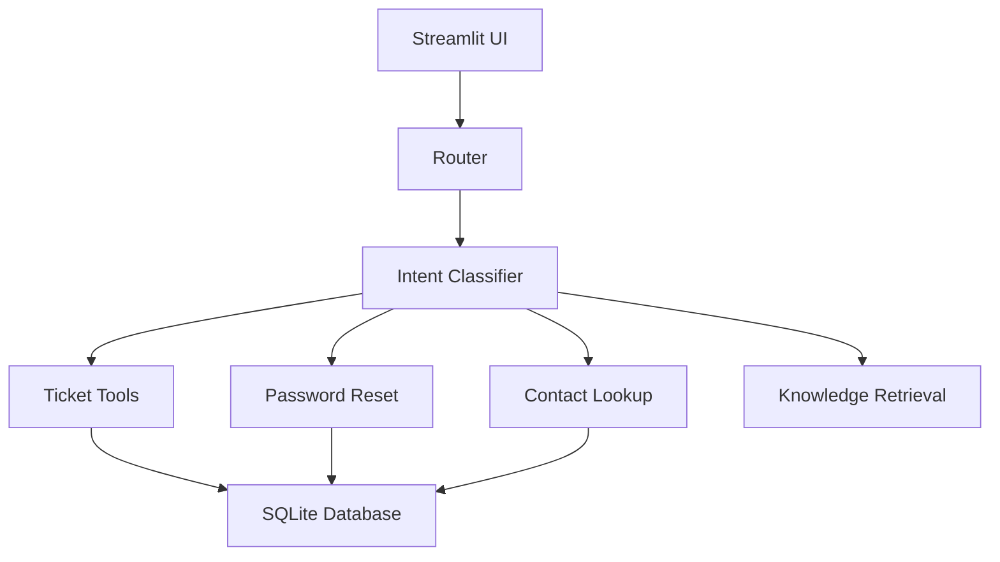
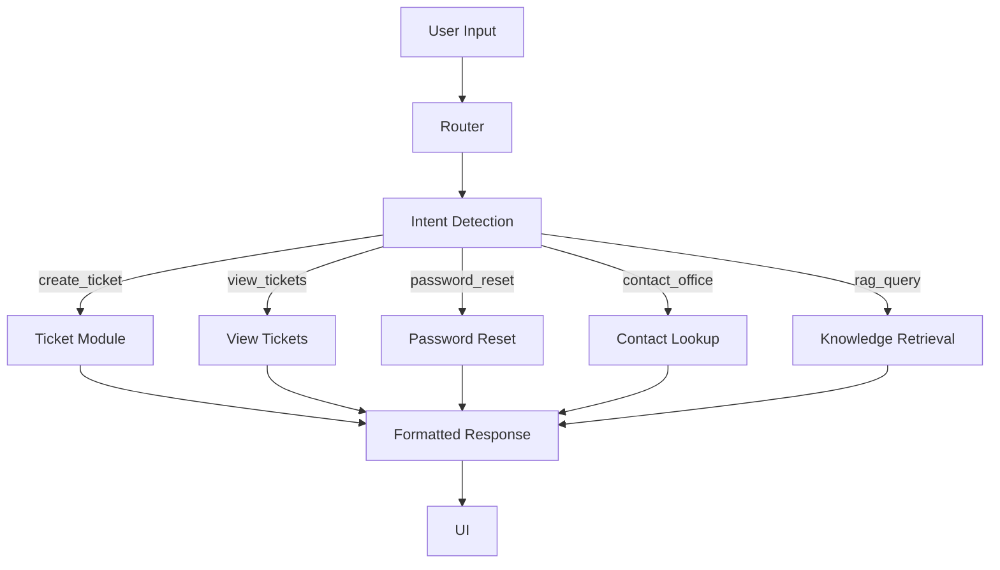

# College Helpdesk AI Project Report

## Overview

The College Helpdesk AI project is a student-facing helpdesk assistant built with Python and Streamlit. It supports login, complaint ticket creation, ticket viewing and deletion, password updates, and local knowledge retrieval for campus questions.

## Approach Comparison

The College Helpdesk AI project uses a hybrid architecture that combines local rule-based intent detection with Ollama LLM-based intent classification and answer generation.

Selected approach:

- Rule-based intent detection in `intents/classifier.py` for deterministic local routing.
- Ollama LLM support via `rag/llm.py` for ticket intent classification and natural answer generation when available.
- Router-based dispatch in `router.py` for ticket creation, ticket viewing, password reset, contact lookup, and information retrieval.
- Local markdown knowledge storage in `knowledge/` for fallback retrieval and context-aware responses.
- Streamlit front end in `frontend/app.py` for a conversational user interface.

Alternative approaches considered:

- **LLM-based conversational AI:** more natural language flexibility, but introduces external dependency and risks hallucinations.
- **Static FAQ-only system:** low complexity, but cannot support transactional workflows like ticket creation or password reset.
- **Hybrid rule-based + retrieval:** chosen because it balances reliability, local execution, and multi-purpose functionality.

The advanced dataset covers:

- Clear requests.
- Ambiguous or tricky requests.
- Multi-step service requests.
- Sensitive information flows such as password reset and contact lookup.

This evaluation measures:

- Intent detection accuracy.
- Tool selection accuracy.
- Response quality through appropriate routing and answer selection.


## System Architecture

The College Helpdesk AI architecture includes:

- `frontend/app.py`: Streamlit UI and session management.
- `router.py`: Query router and intent dispatcher.
- `intents/classifier.py`: Rule-based intent classification.
- `tools/`: Auth, ticket, password reset, and contact lookup modules.
- `knowledge/`: Local markdown knowledge files.
- `rag/`: Ollama LLM and retrieval support, including intent classification and answer generation.
- `database/` and `college_db/`: SQLite storage for users and tickets.
- `evaluation/`: Test scripts and datasets.

### Architecture Diagram



### Request Handling Flow

1. The user logs in through Streamlit.
2. The user submits a query.
3. The router classifies intent.
4. The query is dispatched to the correct module.
5. The selected module executes and returns a response.
6. The response is displayed in the UI.




## Used Tools and Technologies

- Python 3.13
- Streamlit
- SQLite
- Markdown knowledge base
- Git and GitHub

## Project Structure

```text
college_helpdesk_ai/
├── frontend/
│   └── app.py
├── intents/
│   └── classifier.py
├── knowledge/
│   └── *.md
├── tools/
│   ├── auth.py
│   ├── contact_tool.py
│   ├── password_reset.py
│   ├── ticket_list.py
│   └── ticket_tool.py
├── database/
│   └── *.db
├── router.py
├── README.md
├── report.md
├── requirements.txt
└── .gitignore
```


## Detailed Feature Flow

### Login

The app uses `tools/auth.py` to validate student credentials from `database/users.db`. Successful authentication sets the Streamlit session state.

### Ticket Management

- **Create ticket**: Students can report issues such as hostel problems or WiFi outages.
- **View tickets**: The app lists complaints from the SQLite ticket database.
- **Delete ticket**: The app asks which ticket to remove before deletion.

### Password Reset

The project supports password update requests through the chatbot. When a user says `i want to reset my password`, the router sets a password-reset action and prompts for the new password.

### Knowledge Retrieval

Informational queries are answered from local markdown files in `knowledge/`. This avoids dependency on remote LLM services and keeps answers consistent with campus information.

## Test Results

The advanced evaluation executed `evaluation/evaluate_advanced.py` against `evaluation/advanced_test_cases.json`.

Dataset coverage:

- `rag`: campus information requests.
- `password_reset`: password support requests.
- `create_ticket`: issue reporting and complaint creation.
- `view_tickets`: ticket status and history queries.
- `contact_office`: campus office contact inquiries.
- `greeting`: conversational salutations.
- `tricky`: ambiguous or edge-case queries.

Results:

- Total test cases: **50**
- Correct predictions: **50**
- Incorrect predictions: **0**
- Overall accuracy: **100.00%**

Category performance:

- `rag`: 14/14 (100.00%)
- `password_reset`: 6/6 (100.00%)
- `create_ticket`: 8/8 (100.00%)
- `view_tickets`: 8/8 (100.00%)
- `contact_office`: 6/6 (100.00%)
- `greeting`: 4/4 (100.00%)
- `tricky`: 4/4 (100.00%)

This confirms accurate intent detection, correct tool selection, and appropriate response routing across the evaluated request types.

## Challenges Faced

- Distinguishing ambiguous wording between knowledge queries and ticket creation.
- Ensuring the router selected the correct tool module for each request category.
- Designing the evaluation dataset to include clear, ambiguous, multi-step, and sensitive flows.
- Delivering reliable local knowledge answers without an external LLM dependency.
- Managing secure password reset handling within a prototype.

## Future Improvements

- Add password hashing and stronger validation for password reset operations.
- Expand the evaluation dataset to cover more multi-turn and sensitive interactions.
- Improve knowledge retrieval with semantic or vector-based search.
- Add human evaluation of response quality in addition to routing accuracy.
- Enhance the Streamlit UI with clearer prompts and next-step guidance.
- Add end-to-end automated tests and deployment support.
```
