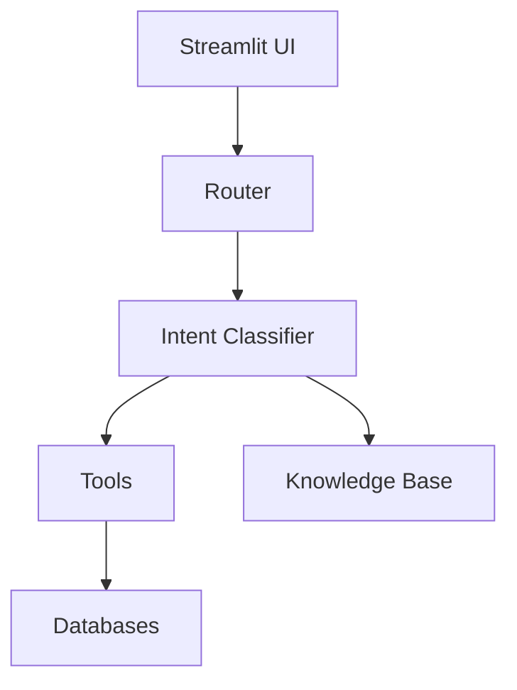
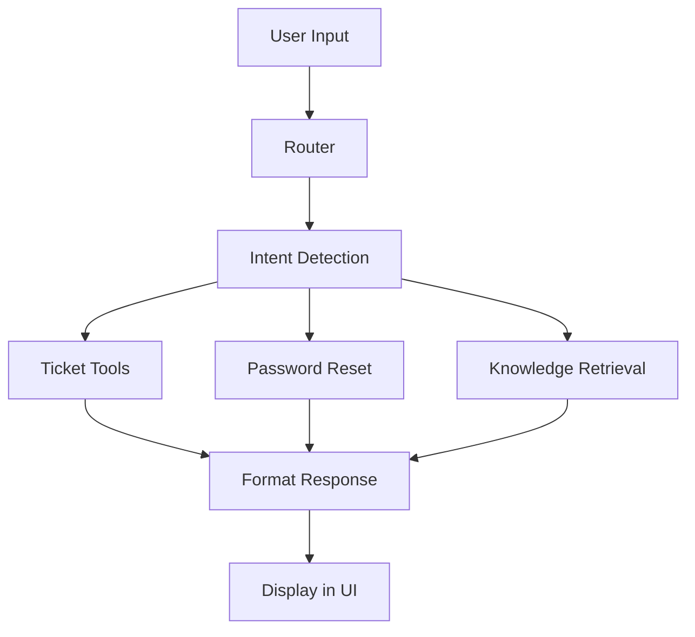

# College Helpdesk AI Project Report

## Overview

The College Helpdesk AI project is a student-facing helpdesk assistant built with Python and Streamlit. It supports login, complaint ticket creation, ticket viewing and deletion, password updates, and local knowledge retrieval for campus questions.

## Objectives

- Build a conversational helpdesk interface for students.
- Provide local knowledge-based answers for college-related queries.
- Support complaint ticket workflows.
- Support password reset/update interactions.
- Clean up the repository for public GitHub publication.

## Architecture

The system is composed of:

- **Frontend**: Streamlit app in `frontend/app.py`.
- **Router**: Query dispatcher in `router.py`.
- **Intent Classification**: Rule-based logic in `intents/classifier.py`.
- **Knowledge Layer**: Local markdown files under `knowledge/`.
- **Tools**: Utility modules in `tools/` for auth, ticket management, and password reset.
- **Database**: SQLite storage in `database/`.

### Architecture Diagram



## Used Tools and Technologies

- Python 3.13
- Streamlit
- SQLite
- Markdown knowledge base
- Git and GitHub

## Project Structure

```text
college_helpdesk_ai/
├── frontend/
│   └── app.py
├── intents/
│   └── classifier.py
├── knowledge/
│   └── *.md
├── tools/
│   ├── auth.py
│   ├── contact_tool.py
│   ├── password_reset.py
│   ├── ticket_list.py
│   └── ticket_tool.py
├── database/
│   └── *.db
├── router.py
├── README.md
├── report.md
├── requirements.txt
└── .gitignore
```

## Working Flow

1. Student logs in through the Streamlit UI.
2. The student submits a chat query.
3. The router classifies the intent.
4. If the intent is ticket-related, ticket tools run.
5. If the intent is password reset, the bot requests or updates the password.
6. If the intent is informational, the local knowledge base is used.
7. The answer is formatted and shown in the UI.

### Working Flow Chart



## Detailed Feature Flow

### Login

The app uses `tools/auth.py` to validate student credentials from `database/users.db`. Successful authentication sets the Streamlit session state.

### Ticket Management

- **Create ticket**: Students can report issues such as hostel problems or WiFi outages.
- **View tickets**: The app lists complaints from the SQLite ticket database.
- **Delete ticket**: The app asks which ticket to remove before deletion.

### Password Reset

The project supports password update requests through the chatbot. When a user says `i want to reset my password`, the router sets a password-reset action and prompts for the new password.

### Knowledge Retrieval

Informational queries are answered from local markdown files in `knowledge/`. This avoids dependency on remote LLM services and keeps answers consistent with campus information.

## Cleanup and GitHub Preparation

Cleanup actions completed:

- Removed generated `__pycache__` folders.
- Removed root-level test files that were not needed to run the project.
- Added `.gitignore` to exclude `venv/`, Python caches, and environment artifacts.
- Added a README and report files to document the project.

## GitHub Status

The repository has been published to:

- https://github.com/mondisailokesh/college-helpdesk-ai

The `main` branch tracks `origin/main` and includes the cleanup commit.

## Future Improvements

- Add a hosted LLM integration for improved conversational answers.
- Add automated tests for key flows.
- Expand the knowledge retrieval engine with vector search.
- Add user registration and recovery flows.

## Conclusion

The College Helpdesk AI project now includes both Markdown and LaTeX project reports with architecture diagrams, flowcharts, project structure, used tools, and working flow documentation. The repository is cleaned and ready for publication.
```
